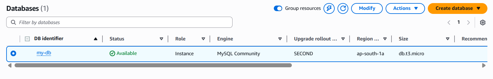
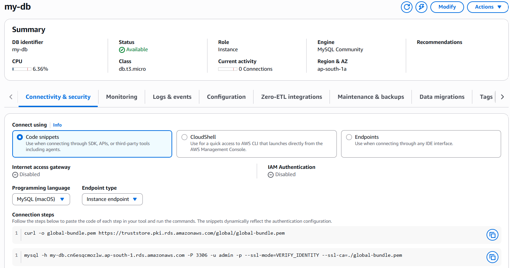
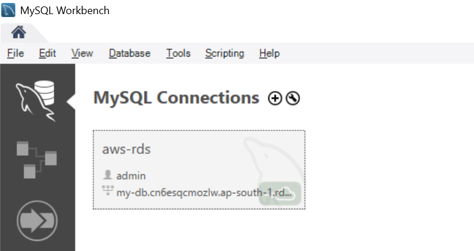
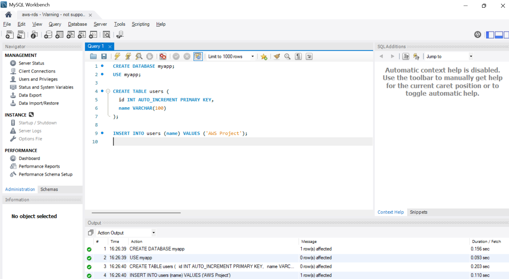
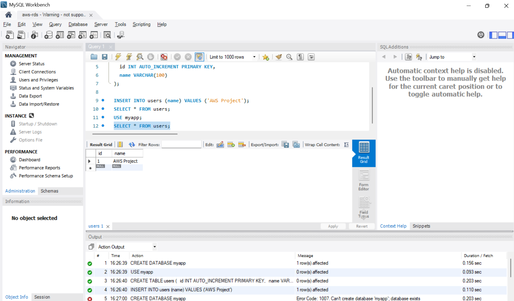

# aws-elastic-beanstalk-rds-project

# 🚀 High Availability PHP Application using Elastic Beanstalk & RDS

## 📌 Project Overview
This project demonstrates how to deploy a highly available and scalable PHP web application using AWS services.

The application is hosted on Elastic Beanstalk and connected to an external Amazon RDS MySQL database. The database is decoupled from the application lifecycle, enabling better scalability, reliability, and flexibility.

---

## 🏗️ Architecture
User → Load Balancer → Elastic Beanstalk (EC2 Instances) → Amazon RDS (MySQL)

---

## ⚙️ Services Used
- AWS Elastic Beanstalk (Application Deployment & Auto Scaling)
- Amazon RDS (MySQL Database)
- EC2 (Managed by Beanstalk)
- Auto Scaling
- Application Load Balancer

---

## 🎯 Key Features
- High Availability using Load Balancer
- Auto Scaling based on traffic
- External Database (Decoupled Architecture)
- Easy Deployment using Elastic Beanstalk

---

## ⚠️ Challenges Faced

### 1. Unable to Connect to RDS from MySQL Workbench

Initially, I was unable to connect to the RDS MySQL instance using MySQL Workbench, even after configuring the endpoint and security group.

#### 🔍 Root Cause:

* Misconfiguration in networking components such as subnets and route tables
* Confusion due to AWS console showing "Internet access gateway: Disabled" even after correct setup

#### 🛠️ Solution:

* Verified and corrected subnet and route table configurations
* Ensured Internet Gateway routing (`0.0.0.0/0`) was properly set
* Enabled public accessibility for the RDS instance
* Validated connectivity directly using MySQL Workbench instead of relying only on console indicators

#### ✅ Outcome:

* Successfully connected to the RDS instance
* Created database, tables, and inserted data
* Gained strong understanding of AWS networking concepts

---

### 💡 Key Learnings:

* Difference between public and private subnets
* Importance of route tables and Internet Gateway in AWS
* Real-world debugging approach by validating connectivity practically

## 🛠️ Steps to Implement

### 1. Create RDS Database
- Engine: MySQL
- Instance: db.t3.micro (Free Tier)
- Created database and table

### 2. Prepare PHP Application
- Created `index.php` to connect RDS and fetch data
- [To view index.php code](index1.php)

### 3. Deploy Application
- Created Elastic Beanstalk environment
- Uploaded application ZIP file

### 4. Configure Auto Scaling
- Min Instances: 1
- Max Instances: 2

### 5. Configure Security Groups
- Allowed HTTP (80) for EC2
- Allowed MySQL (3306) for RDS

## 🗄️ Database Setup using MySQL Workbench

Connected AWS RDS MySQL instance using MySQL Workbench and created database & table.

### Steps:
- Connected to RDS using endpoint
- Created database `myapp`
- Created table `users`
- Inserted sample data

### 🔐 Security Group Configuration

Configured inbound rules to allow application and database access:

- SSH (22) → EC2 access
- HTTP (80) → Web traffic
- HTTPS (443) → Secure web traffic
- MySQL (3306) → RDS database connection

### Screenshots:

### 📌 RDS Instance Created

Successfully created an Amazon RDS MySQL instance using the free tier configuration.

* Engine: MySQL Community
* Instance Type: db.t3.micro
* Region: ap-south-1 (Mumbai)
* Status: Available
This confirms that the database is up and ready to accept connections.

### 🔗 RDS Connectivity Details

The RDS instance endpoint was used to establish a connection from external tools like MySQL Workbench.

* Endpoint: `my-db.cn6esqcmozlw.ap-south-1.rds.amazonaws.com`
* Port: `3306`
* Username: `admin`

Using these details, a successful connection was established and verified.

> Note: Although the AWS console displayed "Internet access gateway: Disabled", the database was accessible and connectivity was successfully tested using MySQL Workbench.

### 🖥️ MySQL Workbench Connection

Configured a connection in MySQL Workbench to access the AWS RDS instance.

* Connection Name: aws-rds
* Hostname: my-db.cn6esqcmozlw.ap-south-1.rds.amazonaws.com
* Port: 3306
* Username: admin
This connection was successfully used to access the database and execute SQL queries.

### 🗄️ Database Creation & Data Insertion

Executed SQL queries using MySQL Workbench to set up the database.

* Created database: `myapp`
* Created table: `users`
* Inserted sample data

All queries were executed successfully as shown below.

### 📊 Database Output

Successfully connected to Amazon RDS using MySQL Workbench and verified data insertion.

---

## 🧪 Application Output
The application connects to RDS and displays stored data.

Example Output:
ID: 1 - Name: AWS Project

---

## ⚠️ Challenges Faced
- Database connection issues due to security groups
- Configuring correct RDS endpoint
- Understanding Elastic Beanstalk environment setup

---

## 💡 Learning Outcomes
- Learned how to deploy applications using Elastic Beanstalk
- Understood Auto Scaling and Load Balancing
- Implemented decoupled architecture using RDS

---

## 📸 Screenshots
Refer to the screenshots folder for step-by-step visuals.

---

## 📂 Project Structure

---

## 🚀 Conclusion
This project showcases a real-world AWS deployment with high availability, scalability, and proper architecture design, suitable for production-like environments.
